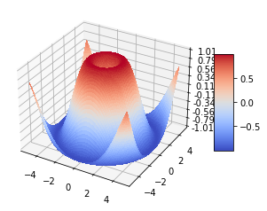

{
 "cells": [
  {
   "cell_type": "markdown",
   "metadata": {},
   "source": [
    "# 课程报告"
   ]
  },
  {
   "cell_type": "markdown",
   "metadata": {},
   "source": [
    "## 一、分布式集群及编程"
   ]
  },
  {
   "cell_type": "markdown",
   "metadata": {},
   "source": [
    "### 1. hadoop集群环境搭建"
   ]
  },
  {
   "cell_type": "markdown",
   "metadata": {},
   "source": [
    "### 2. MapReduce编程"
   ]
  },
  {
   "cell_type": "markdown",
   "metadata": {},
   "source": [
    "### 3. HBase及数据库操作"
   ]
  },
  {
   "cell_type": "markdown",
   "metadata": {},
   "source": [
    "### 4. Spack集群环境搭建"
   ]
  },
  {
   "cell_type": "markdown",
   "metadata": {},
   "source": [
    "### 5. RDD操作"
   ]
  },
  {
   "cell_type": "markdown",
   "metadata": {},
   "source": [
    "### 6. Spack SQL学习过程"
   ]
  },
  {
   "cell_type": "markdown",
   "metadata": {},
   "source": [
    "## 二、数学基础及数据预处理"
   ]
  },
  {
   "cell_type": "markdown",
   "metadata": {},
   "source": [
    "### 1. 概率分布"
   ]
  },
  {
   "cell_type": "markdown",
   "metadata": {},
   "source": [
    "### 2. 信息墒和交叉墒\n",
    "**信息墒公式**\n",
    "\n",
    "$$ H(X) =  -\\sum_{i=1}^n{p(x_i)} log p(x_i) $$\n",
    "\n",
    "其中$$P(x_i)代表随机事件, X为x_i的概率$$\n",
    "\n",
    "\n",
    "**<font color=#00BFFF>信息量</font>:*信息的大小跟随机事件的概率有关。越小概率的事情发生了产生的信息量越大，越大概率的事情发生了产生的信息量越小***\n",
    "\n",
    "**<font color=#00BFFF>信息墒</font>:*信息量度量的是一个具体事件发生了所带来的信息，而熵则是在结果出来之前对可能产生的信息量的期望——考虑该随机变量的所有可能取值，即所有可能发生事件所带来的信息量的期望。即*** \n",
    "\n",
    "$$ H(X) =  -sum(p(x) log_2 p(x_i)) $$\n",
    "**转换一下**\n",
    "$$ H(X) =  -\\sum_{i=1}^n{p(x_i)} log p(x_i) $$\n",
    "\n",
    "**<font color=#00BFFF>补充</font>:这里再说一个对信息熵的理解。信息熵还可以作为一个系统复杂程度的度量，如果系统越复杂，出现不同情况的种类越多，那么他的信息熵是比较大的。如果一个系统越简单，出现情况种类很少（极端情况为1种情况，那么对应概率为1，那么对应的信息熵为0），此时的信息熵较小**\n",
    "\n",
    "**<font color=#00BFFF>交叉墒</font>:*熟悉机器学习的人都知道分类模型中会使用交叉熵作损失函数，也一定对吴恩达的机器学习视频中猫分类器使用的二分类交叉熵印象深刻，但交叉熵究竟是什么？字面上看，交叉熵分两部分“<font color=red>交叉</font>”和“<font color=red>墒</font>”***\n",
    "\n",
    "**<font color=#00BFFF>墒</font>:*熵是服从某一特定概率分布事件的理论最小平均编码长度”，只要我们知道了任何事件的概率分布，我们就可以计算它的熵***\n",
    "\n",
    "**<font color=#00BFFF>交叉墒$\\geqslant$墒</font>:*交叉熵使用$H(P,Q)$表示，意味着使用$P$计算期望，使用$Q$计算编码长度；所以$H(P,Q)$并不一定等于$H(Q,P)$，除了在$P=Q$的情况下，$H(P,Q) = H(Q,P) = H(P),其中$***\n",
    "$$H(P,Q)=E_x\\widetilde~_p[-logQ(x)]$$\n",
    "\n",
    "**<font color=#00BFFF>有一点很微妙但很重要</font>:*对于期望，我们使用真实概率分布$P$来计算；对于编码长度，我们使用假设的概率分布$Q$来计算，因为它是预估用于编码信息的。因为熵是理论上的平均最小编码长度，所以交叉熵只可能大于等于熵。换句话说，如果我们的估计是完美的，即$Q=P$，那么有$H(P,Q) = H(P)$，否则$H(P,Q) > H(P)$***\n",
    "\n",
    "**<font color=#00BFFF>二分类交叉墒</font>:*在二分类模型中，标签只有是和否两种；这时，可以使用二分类交叉熵作为损失函数。假设数据集中只有猫和狗的照片，则交叉熵公式中只包含两种可能性:***\n",
    "\n",
    "$$ H(P,Q) = -\\sum_{i=(cat,dog)}{P(i)}{logQ(i)} $$\n",
    "$$=  -P(cat)logQ(cat)~-~P(dog)logQ(dog)$$\n",
    "**又因为**\n",
    "$$P(cat)=1~-~P(dog)$$\n",
    "**所以交叉墒可以表示为**\n",
    "$$H(P,Q)=-P(cat)logQ(cat)~-~(1~-~P(dog))log(1~-~P(dog))$$\n",
    "**使用如下定义:**\n",
    "$$P = P(cat)$$\n",
    "$$Q = P(cat)$$\n",
    "**二分类的交叉熵可以写作如下形式，看起来就熟悉多了**\n",
    "$$BinaryCrossEtropy=-PlogP-(1-\\tilde{P})log(1-\\tilde{P})$$\n"
   ]
  },
  {
   "cell_type": "markdown",
   "metadata": {},
   "source": [
    "### 3. 假设校验\n",
    "**<font color=#00BFFF>3.1 假设检验定义</font>:*先对总体参数提出某种假设，然后利用样本数据判断假设是否成立。在逻辑上，假设检验采用了反证法，即先提出假设，再通过适当的统计学方法证明这个假设基本不可能是真的***\n",
    "\n",
    "**<font color=#00BFFF>3.2 假设检验的术语</font>:*先对总体参数提出某种假设，然后利用样本数据判断假设是否成立。在逻辑上，假设检验采用了反证法，即先提出假设，再通过适当的统计学方法证明这个假设基本不可能是真的***\n",
    ">- <font color=#00BFFF>3.2.1零假设:$~$</font>是试验者想收集证据予以反对的假设，也称为原假设，通常记为 $H_0$。*<font color=gray>例如：零假设是测试版本的指标均值小于等于原始版本的指标均值。</font>*\n",
    ">- <font color=#00BFFF>3.2.2备择假设:$~$</font>是试验者想收集证据予以支持的假设，通常记为$H_1或H_a$。*<font color=gray>例如：备择假设是测试版本的指标均值大于原始版本的指标均值。</font>*\n",
    ">- <font color=#00BFFF>3.2.3双侧检验:$~$</font>如果备择假设没有特定的方向性，并含有符号“≠”，这样的检验称为双尾检验。*<font color=gray>例如：零假设是测试版本的指标均值等于原始版本的指标均值，备择假设是测试版本的指标均值不等于原始版本的指标均值。</font>*\n",
    ">- <font color=#00BFFF>3.2.4单侧检验:$~$</font>如果备择假设具有特定的方向性，并含有符号 “>” 或 “<” ，这样的检验称为单尾检验。单尾检验分为左尾和右尾。*<font color=gray>例如：零假设是测试版本的指标均值小于等于原始版本的指标均值，备择假设是测试版本的指标均值大于原始版本的指标均值。</font>*\n",
    ">- <font color=#00BFFF>3.2.5检验统计量:$~$</font>用于假设检验计算的统计量。*<font color=gray>例如：Z值、t值、F值、卡方值</font>*\n",
    ">- <font color=#00BFFF>3.2.6显著性水平:$~$</font>当零假设为真时，错误拒绝零假设的临界概率，即犯第一类错误的最大概率，用α表示。*<font color=gray>例如：在5%的显著性水平下，样本数据拒绝原假设。</font>*\n",
    ">- <font color=#00BFFF>3.2.7置信度:$~$</font>置信区间包含总体参数的确信程度，即1-α。*<font color=gray>例如：95%的置信度表明有95%的确信度相信置信区间包含总体参数（假设进行100次抽样，有95次计算出的置信区间包含总体参数）。</font>*\n",
    ">- <font color=#00BFFF>3.2.8置信区间:$~$</font>包含总体参数的随机区间。\n",
    ">- <font color=#00BFFF>3.2.9功效:$~$</font>正确拒绝零假设的概率，即1-β。当检验结果是不能拒绝零假设，人们又需要进行决策时，需要关注功效。功效越大，犯第二类错误的可能性越小。\n",
    ">- <font color=#00BFFF>3.2.10临界值:$~$</font>与检验统计量的具体值进行比较的值。是在概率密度分布图上的分位数。这个分位数在实际计算中比较麻烦，它需要对数据分布的密度函数积分来获得。\n",
    ">- <font color=#00BFFF>3.2.11临界区域:$~$</font>拒绝原假设的检验统计量的取值范围，也称为拒绝域，是由一组临界值组成的区域。如果检验统计量在拒绝域内，那么我们拒绝原假设。\n",
    ">- <font color=#00BFFF>3.2.12P值:$~$</font>在零假设为真时所得到的样本观察结果或获得更极端结果的概率。也可以说，p值是当原假设为真时，错误拒绝原假设的实际概率。\n",
    ">- <font color=#00BFFF>3.2.13效应量:$~$</font>样本间差异或相关程度的量化指标。效应量越大，两组平均数离得越远，差异越大。如果结果具有统计显著性，那么有必要报告效应量的大小。效应量太小，意味着即使结果有统计显著性，也缺乏实用价值。\n",
    "\n",
    "**<font color=#00BFFF>3.3 假设检验的两类错误</font>:**\n",
    "> - <font color=#00BFFF>3.3.1第 I 类错误(弃真错误):$~$</font>零假设为真时错误地拒绝了零假设。犯第 I 类错误的最大概率记为 α（alpha）。\n",
    ">  - <font color=#00BFFF>3.3.1第 II 类错误(取伪错误):$~$</font> 零假设为假时错误地接受了零假设。犯第 II 类错误的最大概率记为 β（beta）。\n",
    "\n",
    "\n",
    "\n",
    "**<font color=#00BFFF>注意</font>:**\n",
    "> - 在假设检验中，我们可能在决策上犯这两类错误。一般来说，在样本量确定的情况下，任何决策无法同时避免这两类错误的发生，即在减少第一类错误发生的同时，会增大第二类错误发生的几率，或者在减少第二类错误发生的同时，会增大第一类错误发生的几率\n",
    "> - 在大多数情况下，人们会控制第一类错误发生的概率。在进行假设检验时，人们通过事先给定显著性水平α的值来控制第一类错误发生的概率，常用的 α 值有 0.01，0.05，0.1。如果犯第一类错误的成本不高，那么可以选择较大的α值；如果犯第一类错误的成本很高，则选择较小的α值。\n",
    "\n",
    "**<font color=#00BFFF>3.4 假设检验的步骤</font>:**\n",
    "> 1. 定义总体\n",
    "> 2. 确定原假设和备择假设\n",
    "> 3. 选择检验统计量（确定假设检验的种类）\n",
    "> 4. 选择显著性水平\n",
    "> 5. 从总体进行抽样，得到一定的数据\n",
    "> 6. 根据样本数据计算检验统计量的具体值\n",
    "> 7. 依据所构造的检验统计量的抽样分布和显著性水平，确定临界值和拒绝域\n",
    "> 8. 比较检验统计量的值与临界值，如果检验统计量的值在拒绝域内，则拒绝原假设\n",
    "\n",
    "**<font color=#00BFFF>3.5 假设检验的决策标准</font>:*由于检验是利用事先给定显著性水平的方法来控制犯错概率的，所以对于两个数据比较相近的假设检验，我们无法知道哪一个假设更容易犯错，即我们通过这种方法只能知道根据这次抽样而犯第一类错误的最大概率，而无法知道具体在多大概率水平上犯错。计算P值有效的解决了这个问题，P值其实就是按照抽样分布计算的一个概率值，这个值是根据检验统计量计算出来的。通过直接比较P值与给定的显著性水平α的大小就可以知道是否拒绝原假设，显然这就可以代替比较检验统计量的具体值与临界值的大小的方法。***\n",
    "\n",
    "**<font color=#00BFFF>注意</font>**\n",
    "> - p值小于0.01---强有力的证据判定备择假设为真；\n",
    "> - p值介于0.01~0.05---有力的证据判定备择假设为真；\n",
    "> - p值介于0.05~0.1---较弱的证据判定备择假设为真；\n",
    "> - p值大于0.1---没有足够的证据判定备择假设为真。\n",
    "\n",
    "**<font color=#00BFFF>3.6 假设检验的种类</font>:$~$*Z检验、t检验、卡方检验、F检验。***\n",
    "> - <font color=#00BFFF>3.6.1 Z检验:$~$</font>Z检验用于比较样本和总体的均值是否不同或者两个样本的均值是否不同。检验统计量z值的分布服从正态分布,由于总体方差一般都是未知的，并且Z检验只适合大样本的情况。\n",
    "> - <font color=#00BFFF>3.6.2 T检验:$~$</font>事先不知道总体方差，另外，如果总体不服从正态分布，那么样本量要大于等于30，如果总体服从正态分布，那么对样本量没有要求.\n",
    "**<font color=#00BFFF>t检验又分为单样本t检验、配对t检验和独立样本t检验。</font>**"
   ]
  },
  {
   "cell_type": "markdown",
   "metadata": {},
   "source": [
    "### 4.矩阵计算\n",
    "**<font color=#00BFFF>4.1 矩阵的加法与减法</font>:$~$**\n",
    "> - <font color=#00BFFF>4.1.1 运算规则:$~$</font>\n",
    ">设矩阵\n",
    "> $$A =\\begin{pmatrix}\n",
    "{a_{11}}&{a_{12}}&{\\cdots}&{a_{1n}}\\\\\n",
    "{a_{21}}&{a_{22}}&{\\cdots}&{a_{2n}}\\\\\n",
    "{\\vdots}&{\\vdots}&{\\ddots}&{\\vdots}\\\\\n",
    "{a_{m1}}&{a_{m2}}&{\\cdots}&{a_{mn}}\\\\\n",
    "\\end{pmatrix}$$\n",
    ">$$B =\\begin{pmatrix}\n",
    "{b_{11}}&{b_{12}}&{\\cdots}&{b_{1n}}\\\\\n",
    "{b_{21}}&{b_{22}}&{\\cdots}&{b_{2n}}\\\\\n",
    "{\\vdots}&{\\vdots}&{\\ddots}&{\\vdots}\\\\\n",
    "{b_{m1}}&{b_{m2}}&{\\cdots}&{b_{mn}}\\\\\n",
    "\\end{pmatrix}$$\n",
    "> 则\n",
    "> $$A\\pm B =\\begin{pmatrix}\n",
    "{a_{11}+b_{11}}&{a_{12}+b_{12}}&{\\cdots}&{a_{1n}+b_{1n}}\\\\\n",
    "{a_{21}+b_{21}}&{a_{22}+b_{21}}&{\\cdots}&{a_{2n}+b_{21}}\\\\\n",
    "{\\vdots}&{\\vdots}&{\\ddots}&{\\vdots}\\\\\n",
    "{a_{m1}+b_{m1}}&{a_{m2}+b_{m2}}&{\\cdots}&{a_{mn}+b_{mn}}\\\\\n",
    "\\end{pmatrix}$$\n",
    "> **简言之，两个矩阵相加减，即它们相同位置的元素相加减！**<br>\n",
    ">**<font color=#00BFFF>注意</font>:$~$ 只有对于两个行数、列数分别相等的矩阵（即同型矩阵），加减法运算才有意义，即加减运算是可行的．**\n",
    "> - <font color=#00BFFF>4.1.2 运算性质:$~$</font>\n",
    "> 满足交换律和结合律\n",
    "> - 交换律 $A+B=B+A$\n",
    "> - 结合律 $(A+B)+C=A+(B+C)$\n",
    "\n",
    "**<font color=#00BFFF>4.2 矩阵与数的乘法</font>:$~$**\n",
    "> - <font color=#00BFFF>4.2.1 运算规则:$~$</font><br>\n",
    "> 　$数\\lambda乘矩阵A，就是将数\\lambda乘矩阵A中的每一个元素，记为\\lambda A或A\\lambda．$<br>特别地，$称-A称A=(a_{ij})_{m \\times n}为的负矩阵．$\n",
    "> - <font color=#00BFFF>4.2.1 运算性质:$~$</font><br>\n",
    "> 满足结合律和分配律\n",
    "> - 分配律 $\\lambda(A+B)=\\lambda A+\\lambda B$\n",
    "> - 结合律 $(\\lambda\\mu)A=A(\\lambda\\mu); (\\lambda+\\mu)\\times A = \\lambda A+ \\mu A$\n",
    "\n",
    "**<font color=#00BFFF>4.3 矩阵与矩阵的乘法</font>:$~$**\n",
    "> - <font color=#00BFFF>4.3.1 运算规则:$~$</font>设\n",
    "> $$A=(a_{ij})_{m \\times n}~~~~B=(b_{ij})_{m \\times n}$$\n",
    "> 则A与B的乘积$C = AB是这样一个矩阵$:\n",
    "> - 行数与（左矩阵）A相同，列数与（右矩阵）B相同，即$$C=(c_{ij})_{m \\times n}$$\n",
    "> - $C的第i行第j列的元素由A的第i行元素与B的第j列元素对应相乘，再取乘积之和$\n",
    "> - <font color=#00BFFF>4.3.2 运算性质:$~$</font><br>\n",
    "> - 结合律 $(A+B)C=A(BC)$\n",
    "> - 分配律 $A(B\\pm C)=AB +AC; (B\\pm C)A=BA +CA$\n",
    "> - $(\\lambda A)B=\\lambda(AB)=A(\\lambda B)$\n",
    "> - <font color=#00BFFF>4.3.2 方阵的幂:$~$</font>设A是方阵，k是一个正整数，规定\n",
    "> $$A^0 =E,~~~A^K=\\underbrace{A·A···A}_{k}$$\n",
    "> 显然记号$A^k$表示A的连乘积.\n",
    "\n",
    "<font color=#00BFFF>4.4 矩阵的转置</font>:$~$**将矩阵A的行换成同序号的列所得到的新矩阵称为矩阵A的转置矩阵，记作$A^`或A^T.例如:$<br>**\n",
    "$$矩阵A=\\begin{bmatrix}\n",
    "1&0&3&1\\\\\n",
    "2&1&0&2\n",
    "\\end{bmatrix}$$\n",
    "转置矩阵为$$矩阵A=\\begin{bmatrix}\n",
    "1&2\\\\\n",
    "0&1\\\\\n",
    "3&0\\\\\n",
    "-1&2\n",
    "\\end{bmatrix}$$\n",
    "- <font color=#00BFFF>4.3.2 运算性质:$~$</font><br>\n",
    "> - $(A^T)^T=A$\n",
    "> - $(A+B)^T=A^T+B^T$\n",
    "> - $(AB)^T=B^TA^T$\n",
    "> - $(\\lambda A)^T=\\lambda A^T,~~\\lambda 是常数$\n",
    "\n",
    "<font color=#00BFFF>4.4 方阵的行列式</font>:$~~$:由方阵A的元素所构成的行列式（各元素的位置不变），称为方阵A的行列式，记作$|A|或det A$\n",
    "- <font color=#00BFFF>4.4.1 运算性质:$~$</font><br>\n",
    "> - $|A^T|=A$\n",
    "> - $|AB|^T=|A|·|B|.~特别:|A^k|=\\underbrace{|A||A|···|A|}_k$\n",
    "> - $|\\lambda A|=\\lambda^n|A|.~(\\lambda是常数,A的阶数为n)$\n",
    "> - $(\\lambda A)^T=\\lambda A^T,~~\\lambda 是常数$"
   ]
  },
  {
   "cell_type": "markdown",
   "metadata": {},
   "source": [
    "### 5.特征值及特征向量\n",
    "<font color=#00BFFF>5.1定义</font>:$~~$设A为n阶实方阵，如果存在某个数$\\lambda_0$及某个n维非零列向量$\\eta$，使得$A\\eta=\\lambda_0\\eta$，则称$\\lambda_0$是方阵A的一个特征值$\\lambda_0$是方阵A的一个特征值，$\\eta$是方阵A的属于特征值$\\lambda^0$的一个特征向量。\n",
    "\n",
    "**<font color=#00BFFF>注意</font>:**\n",
    "> 1. 定义说明特征值与特征向量是紧密相连的概念，对每个特征值必有属于它的特征向量，且有无穷多个；而对每个特征向量必属于某个特征值，且只属于一个特征值.\n",
    "> 2. 特征向量必须是非零向量，且必是列向量.\n",
    "> 3. 若$\\eta_1,\\eta_2$均为A的属于$\\eta_0$的特征向量，则对任何不全为零的数$k_1,k_2,\\eta = k_1\\eta_1+k_2\\eta_2$也是A的属于$\\lambda_0$的特征向量。\n",
    "\n",
    "<font color=#00BFFF>5.2特征根</font>:$~~$设A为n阶实方阵，$\\lambda$为一个参数，称n阶方阵$\\lambda E-A$为A的特征方阵，它的行列式$|\\lambda E-A|$称为A的特征多项式，把$|\\lambda E-A|=0$称为A的特征方程，把特征方程或特征多项式的根称为A的特征根。\n",
    "\n",
    "<font color=#00BFFF>5.3特征多项式</font>:$~~$设$A=(a_{ij})$为n阶实方阵,其特征多项式为 $$|\\lambda E-A|=\\begin{bmatrix}\n",
    "{\\lambda-a_{11}}&{-a_{12}}&{\\cdots}&{-a_{1n}}\\\\\n",
    "{-a_{21}}&{\\lambda-a_{22}}&{\\cdots}&{-a_{2n}}\\\\\n",
    "{\\vdots}&{\\vdots}&{\\ddots}&{\\vdots}\\\\\n",
    "{-a_{m1}}&{-a_{m2}}&{\\cdots}&{\\lambda-a_{mn}}\\\\\n",
    "\\end{bmatrix}$$\n",
    "$=\\lambda^n-(a_{11}+a_{22}+···+a_{nn})\\lambda^{n-1}+···+c_1\\lambda+c_0$<br>由行列式计算可知,行列式$|\\lambda E-A|$的值是$\\lambda$的n次多项式\n",
    "\n",
    "<font color=#00BFFF>5.4推导公步骤</font>:$~~$\n",
    ">1. 写出并计算A的特征多项式$|\\lambda E-A|$\n",
    ">2. 求特征方程$|\\lambda E-A|$=0的所有根，共有n个根（其中可能有复根，也可能有重根），这些根即为A的全部特征值；\n",
    ">3. 对于A的每一个特征值$\\lambda_i(1\\leq i\\leq n)$，求解齐次线性方程组$|\\lambda E-A|X=0$，则方程组的每一个非零解都是A的属于特征值$\\lambda_i$的特征向量（说明有无穷多个），特别方程组$|\\lambda E-A|X=0$的一个基础解系$\\lambda_{i_1},\\lambda_{i_2}···,\\lambda_{i_n}$就是方阵A的属于$\\lambda_i$的个数达最大的线性无关的特征向量，而且A的属于$\\lambda_i$的全部特征向量为$k_1\\lambda_{i_1},k_2\\lambda_{i_2}···,k_s\\lambda_{i_n}$，其中$k_1,k_2,···,k_s$是不全为零的任意常数。\n",
    "\n",
    ">例:设$A=\\begin{pmatrix}\n",
    "1&2\\\\\n",
    "2&4\n",
    "\\end{pmatrix},求A的所有特征值和特征向量.$ \n",
    "解:$$A的特征多项式|\\lambda E-A|=\\begin{vmatrix}\n",
    "\\lambda-1&-2\\\\\n",
    "-2&\\lambda-4\\\\\n",
    "\\end{vmatrix}=\\lambda(\\lambda-5)$$\n",
    "则A的两个特征值为$\\lambda_1=0,\\lambda_2=5$<br>\n",
    ">$$对\\lambda_1=0,求解齐次方程组(\\lambda E—A)X=0$$\n",
    ">$$0E-A = \\begin{pmatrix}\n",
    "-1&-2\\\\\n",
    "-2&-4\n",
    "\\end{pmatrix}\\to\\begin{pmatrix}\n",
    "1&2\\\\\n",
    "0&0\n",
    "\\end{pmatrix}$$\n",
    ">由此可求出方程组一个基础解系为$\\eta_1=\\begin{pmatrix}\n",
    "-1\\\\\n",
    "1\n",
    "\\end{pmatrix},则A的属于\\lambda_1=0的全部特征向量为k_1\\lambda_1(k_1)\\neq0$\n",
    "\n",
    ">$$对\\lambda_2=5,求解齐次方程组(\\lambda E—A)X=0$$\n",
    ">$$5E-A = \\begin{pmatrix}\n",
    "4&-2\\\\\n",
    "-2&1\n",
    "\\end{pmatrix}\\to\\begin{pmatrix}\n",
    "-2&1\\\\\n",
    "0&0\n",
    "\\end{pmatrix}$$\n",
    ">由此可求出方程组一个基础解系为$\\eta_2=\\begin{pmatrix}\n",
    "1\\\\\n",
    "2\n",
    "\\end{pmatrix},则A的属于\\lambda_2=5的全部特征向量为k_2\\lambda_2(k_2)\\neq0$\n"
   ]
  },
  {
   "cell_type": "markdown",
   "metadata": {},
   "source": [
    "### 6.使用matplotlib绘图\n",
    "<font color=#00BFFF>说明</font>:$~~$ Matplotlib是一个python的 2D绘图库，它以各种硬拷贝格式和跨平台的交互式环境生成出版质量级别的图形。通过Matplotlib，开发者可以仅需要几行代码，便可以生成绘图，直方图，功率谱，条形图，错误图，散点图等\n",
    "\n",
    "<font color=#00BFFF>6.1导包</font>:$~~$ **首先要导入包，在以后的示例中默认已经导入这两个包**\n",
    "```python\n",
    "import matplotlib.pyplot as plt\n",
    "import numpy as np\n",
    "```\n",
    "<font color=#00BFFF>6.2画图</font>:$~~$ **然后画一个最基本的图**\n",
    "```python\n",
    "t = np.arange(0.0, 2.0, 0.01)#x轴上的点，0到2之间以0.01为间隔\n",
    "s = np.sin(2*np.pi*t)#y轴为正弦\n",
    "plt.plot(t, s)#画图\n",
    " \n",
    "plt.xlabel('time (s)')#x轴标签\n",
    "plt.ylabel('voltage (mV)')#y轴标签\n",
    "plt.title('About as simple as it gets, folks')#图的标签\n",
    "plt.grid(True)#产生网格\n",
    "plt.savefig(\"test.png\")#保存图像\n",
    "plt.show()#显示图像\n",
    "```\n",
    "\n",
    "\n",
    "<font color=#00BFFF>6.3定位</font>:$~~$ **这是在一个窗口中画单张图的过程，那么如何画多张图呢？画图的过程相同，无非是画多张，然后设定位置。**\n",
    "```python\n",
    "x1 = np.linspace(0.0, 5.0)#画图一\n",
    "x2 = np.linspace(0.0, 2.0)#画图二\n",
    "y1 = np.cos(2 * np.pi * x1) * np.exp(-x1)\n",
    "y2 = np.cos(2 * np.pi * x2)\n",
    " \n",
    "plt.subplot(2, 1, 1)#面板设置成2行1列，并取第一个（顺时针编号）\n",
    "plt.plot(x1, y1, 'yo-')#画图，染色\n",
    "plt.title('A tale of 2 subplots')\n",
    "plt.ylabel('Damped oscillation')\n",
    " \n",
    "plt.subplot(2, 1, 2)#面板设置成2行1列，并取第二个（顺时针编号）\n",
    "plt.plot(x2, y2, 'r.-')#画图，染色\n",
    "plt.xlabel('time (s)')\n",
    "plt.ylabel('Undamped')\n",
    " \n",
    "plt.show()\n",
    "```\n",
    "\n",
    "\n",
    "<font color=#00BFFF>6.3直方图</font>:$~~$ **直方图的画法**\n",
    "```python\n",
    "# -*- coding:utf-8 -*-\n",
    "import numpy as np\n",
    "import matplotlib.mlab as mlab\n",
    "import matplotlib.pyplot as plt\n",
    " \n",
    "mu = 100  # 正态分布的均值\n",
    "sigma = 15  # 标准差\n",
    "x = mu + sigma * np.random.randn(10000)#在均值周围产生符合正态分布的x值\n",
    " \n",
    "num_bins = 50\n",
    "n, bins, patches = plt.hist(x, num_bins, normed=1, facecolor='green', alpha=0.5)\n",
    "#直方图函数，x为x轴的值，normed=1表示为概率密度，即和为一，绿色方块，色深参数0.5.返回n个概率，直方块左边线的x值，及各个方块对象\n",
    "y = mlab.normpdf(bins, mu, sigma)#画一条逼近的曲线\n",
    "plt.plot(bins, y, 'r--')\n",
    "plt.xlabel('Smarts')\n",
    "plt.ylabel('Probability')\n",
    "plt.title(r'Histogram of IQ: $\\mu=100$, $\\sigma=15$')#中文标题 u'xxx'\n",
    " \n",
    "plt.subplots_adjust(left=0.15)#左边距\n",
    "plt.show()\n",
    "```\n",
    "\n",
    "\n",
    "<font color=#00BFFF>6.4 3D图的画法</font>:$~~$ **3D离散点**\n",
    "```python\n",
    "# encoding: utf-8\n",
    " \n",
    "import matplotlib.pyplot as plt\n",
    "import numpy as np\n",
    "from mpl_toolkits.mplot3d import Axes3D\n",
    " \n",
    "x_list = [[3,3,2],[4,3,1],[1,2,3],[1,1,2],[2,1,2]]\n",
    "fig = plt.figure()\n",
    "ax = fig.gca(projection='3d')\n",
    "for x in x_list:\n",
    "    ax.scatter(x[0],x[1],x[2],c='r')\n",
    "plt.show()\n",
    "```\n",
    "\n",
    "\n",
    "<font color=#00BFFF>6.5 3D图的画法</font>:$~~$ **画空间平面**\n",
    "```python\n",
    "from mpl_toolkits.mplot3d.axes3d import Axes3D\n",
    "from matplotlib import cm\n",
    "import matplotlib.pyplot as plt\n",
    "import numpy as np\n",
    "  \n",
    "fig = plt.figure()\n",
    "ax = fig.add_subplot(1, 1, 1, projection='3d')\n",
    "X=np.arange(1,10,1)\n",
    "Y=np.arange(1,10,1)\n",
    "X, Y = np.meshgrid(X, Y)\n",
    "Z = 3*X+2*Y+30\n",
    "surf = ax.plot_surface(X, Y, Z, rstride=1, cstride=1,cmap=cm.jet,linewidth=0, antialiased=True)\n",
    "ax.set_zlim3d(0,100)\n",
    "fig.colorbar(surf, shrink=0.5, aspect=5)\n",
    "plt.show()\n",
    "```\n",
    "\n",
    "\n",
    "<font color=#00BFFF>6.5 画空间曲面</font>:$~~$ \n",
    "```python\n",
    "from mpl_toolkits.mplot3d import Axes3D\n",
    "from matplotlib import cm\n",
    "from matplotlib.ticker import LinearLocator, FormatStrFormatter\n",
    "import matplotlib.pyplot as plt\n",
    "import numpy as np\n",
    " \n",
    "fig = plt.figure()\n",
    "ax = fig.gca(projection='3d')\n",
    "X = np.arange(-5, 5, 0.1)\n",
    "Y = np.arange(-5, 5, 0.1)\n",
    "X, Y = np.meshgrid(X, Y)\n",
    "R = np.sqrt(X**2 + Y**2)\n",
    "Z = np.sin(R)\n",
    "surf = ax.plot_surface(X, Y, Z, rstride=1, cstride=1, cmap=cm.coolwarm, linewidth=0, antialiased=False)\n",
    "#画表面,x,y,z坐标， 横向步长，纵向步长，颜色，线宽，是否渐变\n",
    "ax.set_zlim(-1.01, 1.01)#坐标系的下边界和上边界\n",
    " \n",
    "ax.zaxis.set_major_locator(LinearLocator(10))#设置Z轴标度\n",
    "ax.zaxis.set_major_formatter(FormatStrFormatter('%.02f'))#Z轴精度\n",
    "fig.colorbar(surf, shrink=0.5, aspect=5)#shrink颜色条伸缩比例（0-1），aspect颜色条宽度（反比例，数值越大宽度越窄）\n",
    "\n",
    "plt.show()\n",
    "```\n",
    "\n",
    "\n",
    "<font color=#00BFFF>6.5 饼图的画法</font>:$~~$ \n",
    "```python\n",
    "# -*- coding: utf-8 -*-\n",
    "import matplotlib.pyplot as plt\n",
    " \n",
    "labels = 'Frogs', 'Hogs', 'Dogs', 'Logs'#设置标签\n",
    "sizes = [15, 30, 45, 10]#占比，和为100\n",
    "colors = ['yellowgreen', 'gold', 'lightskyblue', 'lightcoral']#颜色\n",
    "explode = (0, 0.1, 0, 0)  #展开第二个扇形，即Hogs，间距为0.1\n",
    " \n",
    "plt.pie(sizes, explode=explode, labels=labels, colors=colors,autopct='%1.1f%%', shadow=True, startangle=90)#startangle控制饼状图的旋转方向\n",
    "plt.axis('equal')#保证饼状图是正圆，否则会有一点角度偏斜\n",
    " \n",
    "fig = plt.figure()\n",
    "ax = fig.gca()\n",
    " \n",
    "import numpy as np\n",
    " \n",
    "ax.pie(np.random.random(4), explode=explode, labels=labels, colors=colors,autopct='%1.1f%%', shadow=True, startangle=90, radius=0.25, center=(0, 0), frame=True)\n",
    "ax.pie(np.random.random(4), explode=explode, labels=labels, colors=colors, autopct='%1.1f%%', shadow=True, startangle=90, radius=0.25, center=(1, 1), frame=True)\n",
    "ax.pie(np.random.random(4), explode=explode, labels=labels, colors=colors, autopct='%1.1f%%', shadow=True, startangle=90, radius=0.25, center=(0, 1), frame=True)\n",
    "ax.pie(np.random.random(4), explode=explode, labels=labels, colors=colors, autopct='%1.1f%%', shadow=True, startangle=90,radius=0.25, center=(1, 0), frame=True)\n",
    " \n",
    "ax.set_xticks([0, 1])#设置位置\n",
    "ax.set_yticks([0, 1])\n",
    "ax.set_xticklabels([\"Sunny\", \"Cloudy\"])#设置标签\n",
    "ax.set_yticklabels([\"Dry\", \"Rainy\"])\n",
    "ax.set_xlim((-0.5, 1.5))\n",
    "ax.set_ylim((-0.5, 1.5))\n",
    " \n",
    "ax.set_aspect('equal')\n",
    "plt.show()\n",
    "```\n",
    "\n",
    ""
   ]
  },
  {
   "cell_type": "markdown",
   "metadata": {},
   "source": [
    "### 7.主成因分析"
   ]
  },
  {
   "cell_type": "markdown",
   "metadata": {},
   "source": []
  },
  {
   "cell_type": "markdown",
   "metadata": {},
   "source": [
    "## 三、机器学习及深度学习"
   ]
  },
  {
   "cell_type": "markdown",
   "metadata": {},
   "source": [
    "### 分类问题"
   ]
  },
  {
   "cell_type": "markdown",
   "metadata": {},
   "source": [
    "### 回归问题"
   ]
  },
  {
   "cell_type": "markdown",
   "metadata": {},
   "source": [
    "### 卷积计算"
   ]
  },
  {
   "cell_type": "markdown",
   "metadata": {},
   "source": [
    "### 深度神经网络"
   ]
  },
  {
   "cell_type": "markdown",
   "metadata": {},
   "source": []
  }
 ],
 "metadata": {
  "interpreter": {
   "hash": "0233bebd06b1c8dfbe4378b0a68f7ba42066a2023ae2305a086f654849648f0f"
  },
  "kernelspec": {
   "display_name": "Python 3.8.12 ('PaperClassify')",
   "language": "python",
   "name": "python3"
  },
  "language_info": {
   "codemirror_mode": {
    "name": "ipython",
    "version": 3
   },
   "file_extension": ".py",
   "mimetype": "text/x-python",
   "name": "python",
   "nbconvert_exporter": "python",
   "pygments_lexer": "ipython3",
   "version": "3.9.7"
  },
  "orig_nbformat": 4
 },
 "nbformat": 4,
 "nbformat_minor": 2
}
